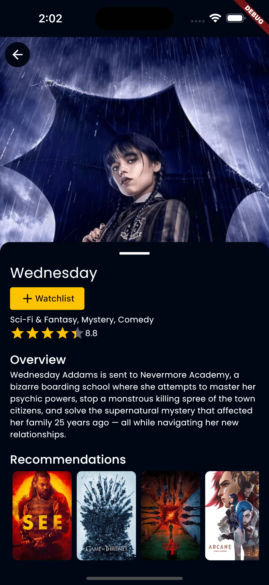

## Description

MoRis merupakan aplikasi menampilkan daftar TV Series populer, top rated, dan yang sedang tayang. Projek ini digunakan untuk menyelesaikan submission bootcamp [Menjadi Flutter Developer Expert ](https://www.dicoding.com/academies/199), berikut kriteria/fitur submission yang harus ada :
1. Aplikasi harus menampilkan daftar TV Series populer, top rated, dan yang sedang tayang.
2. Aplikasi harus menampilkan detail TV Series berdasarkan item yang dipilih.
3. Terdapat fitur untuk mencari TV Series berdasarkan judul dengan memanfaatkan API (bukan filtering secara lokal).
4. Menambahkan daftar TV series yang ingin ditonton ke dalam suatu daftar yang disimpan secara lokal. Daftar watchlist harus tetap bertahan meskipun aplikasi ditutup dan dibuka kembali.
5. Menerapkan Automated Testing minimal testing coverage 70%.
6. Aplikasi wajib menerapkan clean architecture dan membagi source code menjadi 3 layer (domain, data, dan presentation).

 
## Development Setup

Clone the repository and run the following commands:
```
flutter pub get
flutter run
```

## Automated Testing Setup

You can also install  `lcov`  and convert the  `lcov.info`  file to  `HTML`  pages and then see the result in the browser with sorting option.

1. **Installing lcov**
	```
	brew install lcov
	```
2. **Run tests, generate coverage files and convert to HTML**
	```
	flutter test --coverage
	genhtml coverage/lcov.info -o coverage/html
	```
3.  **Open coverage report in browser**
	```
	open coverage/html/index.html
	```

**OR**

You can use a simple dart package ([test_cov_console](https://pub.dev/packages/test_cov_console)). The tool would read the lcov.info that was generated by flutter test --coverage. Find this  [link for source code](https://github.com/DigitalKatalis/test_cov_console).

1. **You can install the lib globally, so it would not change your current project:**
	```
	 flutter pub global activate test_cov_console
	```
2. **And run it:**
	```
	flutter pub global run test_cov_console
	```

## Source

[Dicoding Academy](https://www.dicoding.com/academies/199) <br>
[TMDB API](www.themoviedb.org)

## Screenshot

 &nbsp;  &nbsp;  &nbsp;  &nbsp;  &nbsp;  